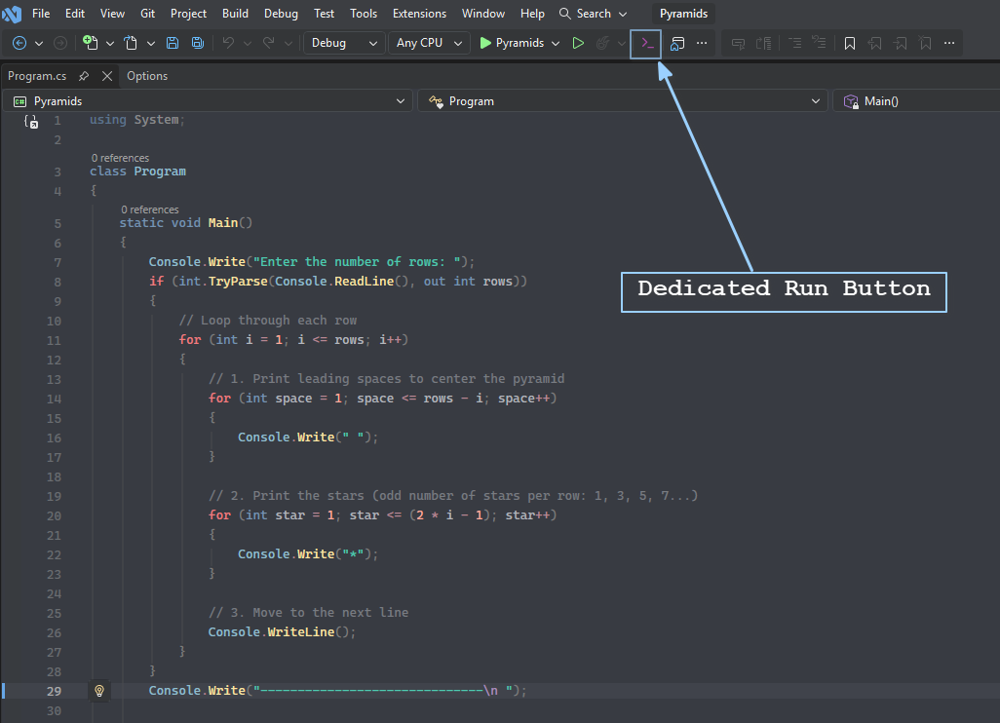
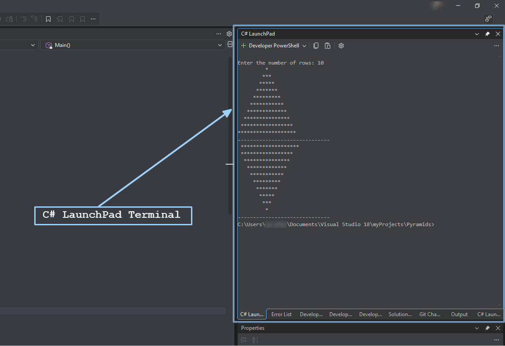

# C# Inline LaunchPad

A lightweight Visual Studio 2026 extension bringing JetBrains Rider-style inline execution and terminal output to C# console projects inside an integrated pane. .

## Features
* **Toolbar Execution & Auto-Save Toggle:** Run active Console projects directly from the main toolbar. Includes a dedicated button to toggle auto-saving files before execution from tools menu.
* **Integrated Terminal Pane:** Embeds standard input and output inside native terminal pane instead of  `cmd.exe` pop-ups.
* **`Alt + F5` Hotkey:** .
* **Interactive Standard I/O:** Full support for `Console.ReadLine()`, `Console.ReadKey()`, and real-time terminal interaction.
* **Process Lifecycle Control:** Automatically reuses terminal tabs and cleanly terminates active background processes to prevent file-lock errors.
* 
| Toolbar Launch Button | Integrated Terminal Output |
| :---: | :---: |
|  |  |
| *Toolbar integration* | *Interactive terminal execution* |
## Installation

1. Download the `.vsix` installer from the [Releases](https://github.com/jafar-alshishani/CSharpInlineLaunchPad/releases) tab or Visual Studio Marketplace.
2. Double-click `CSharpInlineLaunchPad.vsix` to install.
3. Restart Visual Studio 2026.

## Requirement

* Visual Studio 2026 (v17.0+)
* `.NET Core` / `.NET 6+` SDK

## License

Distributed under the [MIT License](LICENSE.txt).
